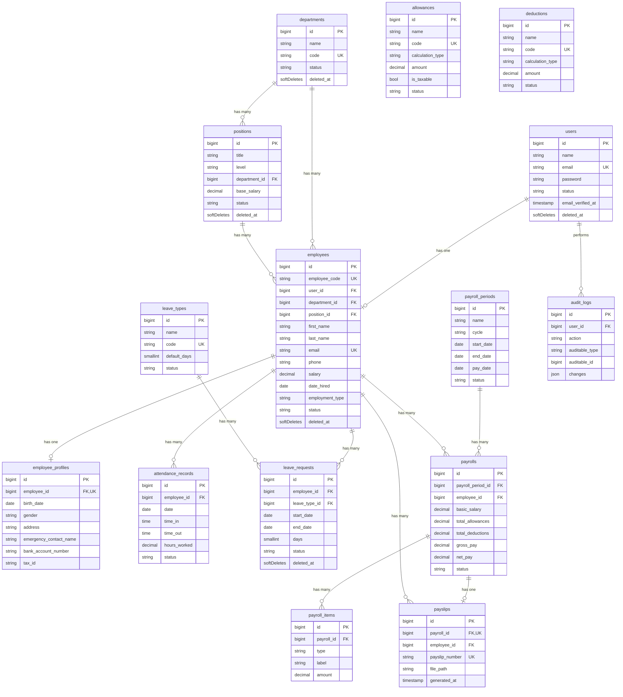

# Database ERD — Employee Management with Payroll (V1)

> MySQL 8 · Laravel 12 migrations live in `backend/database/migrations`.
> Roles/permissions are provided by `spatie/laravel-permission` (`roles`, `permissions`,
> `model_has_roles`, `model_has_permissions`, `role_has_permissions`).

## Entity Relationship Diagram



## Tables (18)

| # | Table | Purpose | Key relationships |
|---|-------|---------|-------------------|
| 1 | `users` | Auth identity (Sanctum + Spatie roles) | hasOne `employees` |
| 2 | `roles` | Spatie roles (Super Admin, HR, Manager, Employee) | — |
| 3 | `permissions` | Spatie permissions | — |
| 4 | `employees` | Core employee record | belongsTo user/department/position |
| 5 | `employee_profiles` | Extended personal/bank details (1:1) | belongsTo employee |
| 6 | `departments` | Org departments | hasMany positions/employees |
| 7 | `positions` | Job positions w/ level + base salary | belongsTo department |
| 8 | `attendance_records` | Daily attendance (unique per employee/day) | belongsTo employee |
| 9 | `leave_types` | Sick / Vacation / Emergency | hasMany leave_requests |
| 10 | `leave_requests` | Leave applications (status only, no engine) | belongsTo employee/leave_type |
| 11 | `payroll_periods` | Pay cycles (weekly…monthly) | hasMany payrolls |
| 12 | `payrolls` | Per-employee payroll for a period | belongsTo period/employee |
| 13 | `payroll_items` | Allowance/deduction/earning line items | belongsTo payroll |
| 14 | `allowances` | Master allowance catalogue | — |
| 15 | `deductions` | Master deduction catalogue | — |
| 16 | `payslips` | Generated payslip (PDF metadata) | belongsTo payroll/employee |
| 17 | `notifications` | Laravel database notifications | morph notifiable |
| 18 | `audit_logs` | Action audit trail | belongsTo user, morph auditable |

## Indexing & integrity highlights

- **Unique:** `employees.employee_code`, `employees.email`, `departments.code`, `leave_types.code`,
  `allowances.code`, `deductions.code`, `payslips.payslip_number`.
- **Composite unique:** `attendance_records(employee_id, date)`, `payrolls(payroll_period_id, employee_id)`,
  one profile/payslip per parent.
- **Indexed:** all `status` columns, foreign keys, and common date filters.
- **Soft deletes:** users, employees, departments, positions, leave_requests (archive-friendly).
- **FK cleanup:** cascade on dependent rows (profiles, items), `nullOnDelete` on optional links
  (employee.user_id, position.department_id).
```
